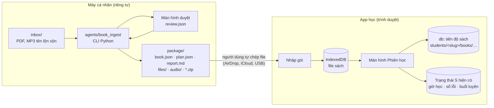

# 02 — Kiến trúc và hợp đồng dữ liệu

Tài liệu tham chiếu cho mọi task trong checklist. Kiến trúc đích giữ đúng technical summary
(agent chuyên việc, tầng công cụ dùng chung, bước duyệt, LangGraph điều phối); phần này
chốt cách hiện thực hóa nó trên mã nguồn hiện có.

## 1. Bức tranh tổng thể

Hệ thống có hai nửa, chỉ nói chuyện với nhau qua file chuẩn:



- **Nội dung sách không bao giờ rời máy người dùng và trình duyệt của họ.** Repo public chỉ
  có code, schema, skill.
- **Hợp đồng là JSON Schema** sinh từ model Pydantic trong `agents/book_ingest/schemas.py`,
  xuất ra `schemas/`. App và pipeline cùng kiểm tra theo một schema, cùng chạy test trên
  một gói mẫu tổng hợp.
- **App là nơi quyết định thứ tự học thực tế** (xếp lớp, rút gọn, phiên kế tiếp), vì những
  luật đó phụ thuộc kết quả học lúc chạy. Pipeline chỉ sinh kế hoạch gốc.

## 2. Cấu trúc thư mục

### 2.1 Repo public

```
ielts-target-5-5/
├─ web/
│  ├─ app.template.html        sửa tại các điểm tích hợp (file 01, mục 3)
│  ├─ src/book/                MỚI — mã hệ thống sách, build.py nhúng vào trang
│  │  ├─ core.js               hàm thuần: hàng đợi phiên, dự báo, xếp lớp, rút gọn, hợp nhất
│  │  ├─ store.js              IndexedDB: sách, file, đáp án, vị trí audio
│  │  ├─ import.js             nhập gói zip hoặc file rời, kiểm tra schema
│  │  ├─ pdf-view.js           PDF.js: tìm đoạn PDF, vẽ trang, phóng to
│  │  ├─ audio-bar.js          <audio> + ±5s, tốc độ, lặp A–B, Media Session
│  │  ├─ answer-sheet.js       phiếu trả lời, tự chấm, đẩy câu sai vào sổ lỗi
│  │  ├─ session.js            màn hình Phiên học, đồng hồ, kết thúc phiên
│  │  ├─ menu.js               tab Sách: cây section → unit → phiên
│  │  └─ book.css
│  ├─ vendor/                  MỚI — pdfjs (bản legacy + worker), fflate; README ghi phiên bản, giấy phép
│  ├─ build.py                 sửa: nhúng src/ và vendor/, bỏ qua docs/
│  └─ index.html, ielts-companion.html   sinh tự động
├─ agents/                     MỚI — dự án uv
│  ├─ pyproject.toml           extras: [ocr] docling, [audio] faster-whisper, [align] whisperx, [review] streamlit
│  ├─ book_ingest/
│  │  ├─ cli.py                Typer: inventory, scan, profile, structure, match, review, plan, pack, validate, ingest
│  │  ├─ schemas.py            Pydantic: FileInfo, BookProfile, Book, Activity, Plan, Session, ReviewItem, BookProgress
│  │  ├─ scan.py  profile.py  structure.py  match.py  plan.py  pack.py  validate.py  report.py
│  │  ├─ llm.py                giao diện extract(schema, prompt, pdf_slice) — chế độ api / manual
│  │  ├─ review_cli.py  review_app.py
│  │  └─ templates/target_gt_v1.py   mẫu phiên của IELTS Target 5.0 GT
│  └─ tests/                   fixtures tổng hợp sinh lúc chạy test — không có nội dung sách thật
├─ schemas/                    book.schema.json, plan.schema.json, review.schema.json, book-progress.schema.json
├─ tests/web/                  node:test cho core.js; e2e Playwright chạy index.html với gói mẫu
├─ .claude/skills/book-ingest/SKILL.md
├─ CLAUDE.md  .gitignore  .github/workflows/ci.yml
└─ docs/agent-hoc-tap/         bộ tài liệu này (build.py bỏ qua, không nhúng vào app)
```

### 2.2 Thư mục làm việc riêng tư (ngoài repo)

```
~/ielts-books/target-5.0/
├─ inbox/      file gốc, không bao giờ bị sửa hay xóa
├─ work/       mỗi bước một file kết quả — đây chính là điểm lưu để chạy tiếp
│  ├─ scan.json  book.yaml  toc.json  structure.json  match.json  review.json  plan.json
│  ├─ llm/     câu hỏi và câu trả lời thô của LLM, để kiểm tra lại
│  └─ cache/   ảnh trang, kết quả whisper, khóa theo sha256 để chạy lại không tốn tiền
└─ package/    gói xuất ra + các file .zip để chép sang điện thoại
```

Pipeline từ chối ghi vào bất kỳ thư mục nào nằm trong một git repo.

## 3. Hợp đồng dữ liệu

### 3.1 Quy tắc chung

| Quy tắc | Nội dung |
|---|---|
| Phiên bản | Mỗi file có trường `schema`: `book/1`, `plan/1`, `review/1`, `book-progress/1`. Đổi không tương thích thì tăng số; app đọc được phiên bản cũ hơn một bậc |
| ID ổn định | Section `S1…S3`; unit đánh số liên tục cả sách `U01…U15`; review `R1…R3`; test `T1…T3`; phiên `S1-U01-1` … `S1-U01-7`. Chạy lại pipeline phải ra đúng ID cũ — tiến độ đã lưu bám vào ID |
| Số trang | `pages` là **chỉ số trang trong file PDF gốc**, bắt đầu từ 1. `printedPages` là số in trong sách, chỉ để hiển thị. App không bao giờ tự cộng trừ độ lệch |
| Track | ID chuẩn theo số in trong sách, ví dụ `CD1-14`. File audio đổi tên theo ID này |
| Thời gian | Ngày dạng `YYYY-MM-DD` theo giờ máy (giống `S` hiện tại); mốc thay đổi `t` là mili giây Unix |

### 3.2 `book.yaml` — hồ sơ cuốn sách

LLM đoán bản nháp, người xác nhận. Đây là chỗ duy nhất chứa "kiểu trình bày" của từng
sách — sách khác chỉ cần hồ sơ khác, không sửa code.

```yaml
book: ielts-target-5.0
title: IELTS Target 5.0
edition: nhan-tri-viet
template: target-gt-v1
files:                                # vai trò → mẫu nhận diện tên file
  course-book: { kind: pdf, match: "(?i)course|student" }
  work-book:   { kind: pdf, match: "(?i)work.?book" }
  test-1:      { kind: pdf, match: "(?i)test.?1" }
  audio:       { kind: audio, match: "(?i)\\.(mp3|m4a)$" }
page_offset:                          # trang in 1 = trang PDF (1 + offset)
  course-book: 8
page_offset_exceptions:               # trang chèn thêm làm lệch số
  course-book: [{ from_printed: 120, offset: 10 }]
track_marker: "(?:CD|Track)\\s*(\\d)[.-](\\d{1,2})"   # dấu track in trong trang sách
track_id: "CD{cd}-{n:02d}"
audio_name_patterns:                  # thử lần lượt trên tên file + tên thư mục
  - "(?i)cd\\s*(?P<cd>\\d).*?(?P<n>\\d{1,2})\\D*$"
  - "(?i)track\\s*(?P<n>\\d{1,2})"
answer_key:  { file: course-book, from_printed: 277 }
audioscript: { file: course-book, from_printed: 250, to_printed: 276 }
skip_sections: [academic]
review_threshold: 0.9                 # độ tin cậy dưới mức này thì đưa vào hộp duyệt
```

### 3.3 `book.json` — bản đồ sách

```json
{
  "schema": "book/1",
  "id": "ielts-target-5.0",
  "title": "IELTS Target 5.0",
  "edition": "nhan-tri-viet",
  "template": "target-gt-v1",
  "generatedAt": "2026-10-20T09:00:00Z",
  "files": {
    "course-book": {
      "kind": "pdf", "pages": 296, "pageOffset": 8,
      "chunks": [
        { "name": "files/course-book/p0001-0058.pdf", "from": 1, "to": 58, "bytes": 8123456, "sha256": "…" },
        { "name": "files/course-book/p0285-0296.pdf", "from": 285, "to": 296, "bytes": 1250000, "sha256": "…" }
      ]
    },
    "CD1-14": { "kind": "audio", "name": "audio/CD1-14.mp3", "durationSec": 183.4, "bytes": 2934567, "sha256": "…" }
  },
  "sections": [
    {
      "id": "S1", "title": "Section 1",
      "items": [
        {
          "id": "U04", "kind": "unit", "no": 4, "title": "…",
          "activities": [
            {
              "id": "U04-listening", "module": "listening", "skill": "listening",
              "pdf": "course-book", "pages": [52, 55], "printedPages": [44, 47],
              "tracks": ["CD1-14", "CD1-15"],
              "answerPages": [290], "questions": { "from": 1, "to": 10 },
              "estMinutes": 75, "confidence": 1.0
            }
          ]
        },
        { "id": "R1", "kind": "review", "no": 1, "activities": [] },
        { "id": "T1", "kind": "test",   "no": 1, "activities": [] }
      ]
    }
  ],
  "skipped": [{ "id": "academic", "reason": "skip_sections" }]
}
```

| Trường của hoạt động | Bắt buộc | Ghi chú |
|---|---|---|
| `module` | có | `speaking-vocab`, `listening`, `reading`, `writing`, `consolidation`, `workbook`, `review`, `test-listening`, `test-reading`, `test-writing`, `test-speaking` — chuỗi tự do để sách khác thêm module khác |
| `skill` | có | `listening`, `reading`, `writing`, `speaking`, `vocab`, `grammar`, `other` — app dùng để chọn rail màu và mã kỹ năng sổ lỗi |
| `pdf`, `pages` | có | khóa trong `files` và khoảng trang PDF gốc |
| `tracks` | không | danh sách ID track theo thứ tự phát |
| `answerPages` | không | trang đáp án để mở ở chế độ tự chấm |
| `questions` | không | khoảng số câu; không có thì phiếu trả lời mặc định 10 câu, người học sửa được |
| `vocabPages` | không | trang Vocabulary / Key exam vocabulary để block 15′ từ vựng trỏ tới |
| `confidence` | có | mức tin cậy thấp nhất trong các phép ghép của hoạt động; sau duyệt là 1.0 |

`book.json` không chứa chữ, ảnh, audio hay đáp án của sách — chỉ có cấu trúc, số trang,
tên unit. Dù vậy nó vẫn nằm trong gói riêng tư, không commit.

### 3.4 Mẫu phiên `target-gt-v1`

Mẫu phiên là code trong `agents/book_ingest/templates/target_gt_v1.py`, và một bản sao
khung (chỉ ID và tên module) trong `web/src/book/core.js` cho chế độ không gói (mục 5.8).
Một test hợp đồng bảo đảm hai bên sinh ra cùng danh sách ID.

| Loại | Phiên | `step` theo thứ tự | Phiên "lõi" — không luật nào được cắt |
|---|---|---|---|
| Unit | 7 | `speaking-vocab` · `listening` · `reading` · `writing-learn` (học kỹ năng, dàn ý, viết) · `writing-review` (chấm, viết lại) · `consolidation` · `workbook` (Work Book + sổ lỗi) | `speaking-vocab`, `writing-learn`, `writing-review` |
| Review | 2 | `review-1` · `review-2` | — |
| Test | 3 | `test-lr` (Listening + Reading) · `test-ws` (Writing + Speaking) · `test-grade` (chấm, ghi sổ lỗi) | `test-lr`, `test-ws` — bài đo không bao giờ bỏ |

Mỗi section: 5 unit × 7 + 2 + 3 = 40 phiên; cả sách 120 phiên × 75 phút ≈ 150 giờ.

### 3.5 `plan.json` — kế hoạch gốc

```json
{
  "schema": "plan/1",
  "bookId": "ielts-target-5.0",
  "template": "target-gt-v1",
  "startWeek": 6,
  "sessionsPerWeek": 6,
  "minutesPerSession": 75,
  "rules": {
    "placementThreshold": 0.8,
    "shortenIfFinishAfterWeek": 30,
    "consolidationSkipWorkbook": 0.8,
    "coreModules": ["speaking-vocab", "writing-learn", "writing-review", "test-lr", "test-ws"]
  },
  "sessions": [
    {
      "id": "S1-U01-1", "seq": 1, "week": 6, "section": "S1", "item": "U01", "kind": "unit",
      "step": "speaking-vocab", "core": true,
      "activityIds": ["U01-speaking-vocab"], "title": "Unit 1 · Speaking & Vocabulary"
    }
  ]
}
```

- `week = startWeek + floor((seq - 1) / sessionsPerWeek)`. Với 6 phiên/tuần: Section 1 rơi
  vào tuần 6–12, Section 2 tuần 12–19, Section 3 tuần 19–25 — khớp bảng 2.1 của technical summary.
- `week` chỉ là dự kiến ban đầu. App không bám ngày; app mở **phiên chưa xong đầu tiên
  trong hàng đợi**, và dự báo tuần xong từ số phiên còn lại.

### 3.6 `review.json` và `report.md`

Định dạng mục duyệt dùng chung cho mọi agent sau này (hộp duyệt chung ở Giai đoạn 4):

```json
{
  "schema": "review/1",
  "agent": "book-ingest",
  "items": [
    {
      "id": "rv-0007", "kind": "track-match", "severity": "warn",
      "subject": "U04-listening", "confidence": 0.62,
      "proposal": { "tracks": ["CD1-14"] },
      "options": [{ "tracks": ["CD1-14"] }, { "tracks": ["CD1-15"] }],
      "evidence": [
        { "type": "page", "file": "course-book", "page": 52 },
        { "type": "audio", "file": "inbox/CD 1/Track 14 (2).mp3", "transcriptHead": "Unit four. Listening, exercise two." }
      ],
      "decision": null
    }
  ]
}
```

`kind`: `file-role`, `page-offset`, `unit-range`, `track-match`, `track-unused`,
`duplicate-file`, `answer-key`. `decision` là `{ "accept": true }`, `{ "value": … }` hoặc
`{ "skip": true }`. Pipeline chỉ xuất gói khi không còn mục nào có `decision: null`.

`report.md` tóm tắt cho người đọc: số file, file trùng, độ lệch trang, số unit, số track đã
ghép, các mục đã duyệt và ai quyết định, cảnh báo còn lại.

### 3.7 Gói sách

```
package/ielts-target-5.0/
├─ book.json  plan.json  report.md
├─ files/course-book/p0001-0058.pdf …    PDF cắt theo ranh giới section, ≤ 60 trang hoặc ≤ 25 MB mỗi đoạn
├─ files/course-book/p0285-0296.pdf      đáp án luôn nằm đoạn riêng
├─ files/work-book/…  files/test-1/…
└─ audio/CD1-01.mp3 …

package/
├─ ielts-target-5.0__core.zip    book.json, plan.json, report.md
├─ ielts-target-5.0__S1.zip      đoạn PDF và track mà Section 1 dùng
├─ ielts-target-5.0__S2.zip  __S3.zip  __tests.zip
```

- **Vì sao cắt PDF:** đọc từ Blob, PDF.js thường phải giữ nguyên file trong bộ nhớ. Một
  cuốn scan 100 MB trên iPhone dễ làm Safari tự tải lại trang. Đoạn 60 trang vừa nhẹ vừa không phải
  mở lại file liên tục. `book.json` vẫn ghi trang theo file gốc; app tra `chunks` để biết
  trang nằm ở đoạn nào.
- **Vì sao chia zip theo section:** chép và nhập từng phần trên điện thoại, không phải giữ
  500 MB trong bộ nhớ một lúc. Zip ở chế độ không nén (PDF, MP3 vốn đã nén) để giải nén
  dạng luồng nhanh.
- App cũng nhận file rời (chọn nhiều file một lúc) cho trường hợp không muốn dùng zip.

### 3.8 Tiến độ sách trên máy chủ

Tài liệu riêng, không nằm trong `S` (tránh trần 256 KiB, xem B4):

```
students/<slug>/books/<bookId>                    tiến độ: settings, phiên, xếp lớp, rút gọn
students/<slug>/books/<bookId>/answers/<sessionId>   câu trả lời của từng phiên
```

```json
{
  "schema": "book-progress/1",
  "bookId": "ielts-target-5.0",
  "settings": { "sessionsPerWeek": 6, "startWeek": 6, "t": 1760000000000 },
  "sessions": {
    "S1-U01-2": { "st": "done", "min": 82, "d": "2026-11-03", "score": { "right": 7, "total": 10 }, "t": 1760000000000 },
    "S1-U01-3": { "st": "doing", "min": 30, "startedAt": 1760000000000, "t": 1760000000000 },
    "S1-U02-3": { "st": "skipped", "why": "placement", "t": 1760000000000 }
  },
  "placement": { "S2": { "pct": 0.85, "unitsWithErrors": ["U07", "U09"], "t": 1760000000000 } },
  "shortening": { "skipWorkbookIfConsolidation": false, "mergeReview": false, "t": 1760000000000 }
}
```

- **Hợp nhất theo từng phiên:** bản ghi nào có `t` lớn hơn thì thắng. Không xóa vật lý —
  bỏ đánh dấu là ghi `st: "todo"` với `t` mới. Nhờ vậy hai thiết bị học song song không đè nhau.
- `S` hiện tại thêm đúng một trường nhỏ `books: ["ielts-target-5.0"]` để các nút xóa và xuất
  JSON biết phải xử lý những tài liệu nào.
- Không ghi vào `roster/<slug>`. Tab Lịch sử không hiện tiến độ sách.
- Không bao giờ ghi lên máy chủ: file sách, `book.json`, đáp án số hóa, bản ghi âm.

### 3.9 IndexedDB trong trình duyệt

Cơ sở dữ liệu `ielts-books`, phiên bản 1:

| Store | Khóa | Giá trị |
|---|---|---|
| `books` | `bookId` | `{ book, plan, importedAt, parts: { S1: true, … } }` |
| `blobs` | `bookId + ":" + đường dẫn trong gói` | `Blob` (PDF đoạn, MP3) |
| `answers` | `bookId + ":" + activityId` | đáp án số hóa nếu có (task P3-11) — chỉ ở máy này |
| `align` | `bookId + ":" + trackId` | mốc thời gian từng từ (Giai đoạn 3) |
| `kv` | chuỗi | vị trí audio từng track, bản ghi âm Speaking, cài đặt nhỏ |

Lưu `Blob` trong IndexedDB được mọi trình duyệt mục tiêu hỗ trợ; việc nó có giữ được
vài trăm MB bên trong khung artifact trên iPhone hay không là câu hỏi của spike S0.1.
OPFS chỉ dùng nếu spike cho thấy IndexedDB thiếu dung lượng.

## 4. Agent nhập sách — chi tiết từng bước

Mỗi bước là một hàm thuần: đọc file của bước trước trong `work/`, ghi file của mình.
Chạy lại một bước không làm lại các bước trước (trừ khi `--force`). Lệnh `book ingest`
chạy nối các bước và dừng ở bước duyệt nếu còn mục chưa quyết.

| Lệnh | Việc | Công cụ | AI | Đầu ra |
|---|---|---|---|---|
| `book inventory <inbox>` | In danh sách file, cỡ, số trang, tỷ lệ trang có chữ, độ dài audio, mẫu tên file — **không in nội dung sách**, để gửi khi cần gỡ lỗi | PyMuPDF, ffprobe | không | stdout |
| `book scan` | Liệt kê, sha256, tìm file trùng, PDF có lớp chữ hay scan, mục lục nhúng (`get_toc()`), thông tin audio (độ dài, tag track/album) | PyMuPDF, ffprobe | không | `scan.json` |
| `book profile` | Gán vai trò file (course-book, work-book, test-n, audio); tìm trang mục lục; gửi riêng các trang đó dạng PDF cắt nhỏ cho LLM, nhận JSON theo schema | Anthropic SDK structured outputs | **có** | `book.yaml` nháp, `toc.json` |
| `book structure` | Tính độ lệch số trang; dựng khoảng trang cho từng module; kiểm tra tiêu đề unit có thật ở trang đã đoán | PyMuPDF, regex | không | `structure.json` |
| `book match` | Tìm dấu track trong trang sách; đọc số track từ tên file; ghép; whisper cho file không tên | regex, rapidfuzz, faster-whisper | whisper | `match.json` |
| `book review` | Hiện các mục dưới ngưỡng tin cậy; người đồng ý, sửa hoặc bỏ qua | Streamlit (hoặc `--cli`) | không | `review.json` |
| `book plan` | Áp mẫu phiên, sinh hàng đợi 120 phiên và tuần dự kiến | code cố định | không | `plan.json` |
| `book pack` | Cắt PDF, đổi tên audio, ghi `book.json`, `report.md`, tạo zip theo section | PyMuPDF, zipfile | không | `package/` |
| `book validate <pkg>` | Schema, tham chiếu chéo, file tồn tại, sha256, số phiên | jsonschema | không | mã thoát 0/1 |

### 4.1 Độ lệch số trang — code cố định, không cần AI

1. Với PDF có lớp chữ: lấy dòng trên cùng và dưới cùng của mỗi trang, tìm số đứng riêng.
2. Tính `chỉ số PDF − số in` cho từng trang có số; giá trị xuất hiện nhiều nhất là độ lệch.
3. Đoạn nào lệch khác (trang màu chèn thêm) ghi vào `page_offset_exceptions` và thành mục duyệt.
4. PDF scan: chỉ OCR dải đầu trang và chân trang (Docling) hoặc gửi ảnh vài trang cho Claude
   — không OCR cả cuốn.

Đạt khi ít nhất 80% trang mẫu khớp độ lệch; không đạt thì cả hồ sơ thành mục duyệt.

### 4.2 Hiểu mục lục — chỗ duy nhất của Giai đoạn 1 cần LLM

- Đầu vào: 2–6 trang mục lục cắt thành PDF nhỏ (gửi dạng `document`, Claude đọc được cả
  bản có chữ lẫn bản scan) + danh sách file từ `scan.json`.
- Đầu ra: model Pydantic `TocDraft` — section, unit (số, tên, trang in bắt đầu), trang bắt
  đầu từng module, review, test, đáp án, audio script, ví dụ dấu track nhìn thấy.
- Gọi bằng SDK chính thức `anthropic`, structured outputs với model Pydantic làm schema.
  Model mặc định `claude-opus-5-5`, đổi qua biến `BOOK_LLM_MODEL`. Kết quả lưu ở `work/llm/`
  và cache theo sha256 đầu vào: chạy lại không tốn tiền.
- Chế độ `--llm manual`: ghi sẵn trang mục lục dạng chữ + file YAML trống để Claude Code
  (qua skill) hoặc người tự điền — không cần API key, tính vào gói Claude hiện có.
- Mọi con số LLM trả về đều được kiểm tra lại bằng code ở bước `structure` (tiêu đề "Unit 4"
  có thật ở trang đó, lệch tối đa 1 trang). Sai thì thành mục duyệt, không âm thầm sửa.

### 4.3 Ghép audio — mức tin cậy

| Cách ghép | Tin cậy |
|---|---|
| Tên file khớp đúng một mẫu trong `audio_name_patterns`, không trùng | 1.0 |
| Thứ tự file trong thư mục CD khớp đúng số dấu track trong sách của CD đó, độ dài hợp lý | 0.8 |
| rapidfuzz ≥ 90, hơn phương án thứ hai ít nhất 10 điểm | 0.85 |
| Whisper nghe 20 giây đầu, câu giới thiệu khớp "Unit/Track…" | 0.7–0.9 theo độ giống |
| Còn lại | 0 — luôn vào hộp duyệt |

Dưới `review_threshold` (mặc định 0.9) thì vào hộp duyệt. Track không gắn vào hoạt động nào
và hoạt động Listening không có track nào đều thành mục duyệt.

### 4.4 Kiểm tra tất định trước khi xuất gói

| Mã | Kiểm tra |
|---|---|
| V1 | Độ lệch trang khớp ≥ 80% trang mẫu |
| V2 | Mỗi unit trong mục lục có tiêu đề ở trang bắt đầu (± 1 trang) |
| V3 | Khoảng trang các module tăng dần, không chồng nhau, nằm trong file |
| V4 | Mỗi hoạt động Listening có ít nhất 1 track; mỗi track dùng đúng một lần |
| V5 | Audio dài từ 5 giây tới 20 phút; không có hai file cùng sha256 |
| V6 | Mỗi unit có trang đáp án |
| V7 | Số phiên đúng mẫu: 120 với `target-gt-v1` |
| V8 | Mọi file trong `book.json` tồn tại trong gói, đúng cỡ và sha256 |

## 5. App — tích hợp chi tiết

### 5.1 Nguyên tắc

- Mã mới nằm trong `web/src/book/`, `build.py` nhúng vào trang theo thứ tự cố định. Không
  dời mã cũ ra file khác trong đợt này — tránh một lần sửa lớn khó review.
- Vẫn là JS thuần. Thư viện duy nhất thêm vào: PDF.js (đọc trang) và fflate (giải nén zip),
  vendor vào repo, ghi rõ phiên bản và giấy phép.
- `core.js` chỉ chứa hàm thuần, chạy được cả trong trang lẫn trong Node để test.
- Màn hình Phiên học không nằm trong `renderAll()`. Nó tự giữ PDF và audio, chỉ gọi
  `renderToday()`/`renderProgress()` khi phiên kết thúc.

### 5.2 Tab Sách

Thay tab Tài liệu, giữ nguyên 7 tab. Hai phân đoạn:

- **Sách của tôi:** danh sách sách đã nhập; mỗi sách mở ra cây Section → Unit → 7 phiên với
  trạng thái (chưa học, đang học, xong, bỏ qua kèm lý do). Nút lớn "Học phiên kế tiếp".
  Cài đặt: số phiên mỗi tuần (5/6/7), tuần bắt đầu. Quản lý file: phần nào đã có file,
  dung lượng đã dùng, nhập thêm phần, xóa sách khỏi máy này.
- **Tài liệu miễn phí:** danh sách `RES` hiện tại, không đổi.

### 5.3 Màn hình Phiên học

Đầu màn hình: `Unit 4 · Phiên 2/7 · Listening`, đồng hồ 75 phút tính theo mốc thời gian
và lưu `startedAt` vào tiến độ — đóng app mở lại vẫn đúng.

| Phiên | Trang sách | Audio | Phiếu trả lời | Writing | Speaking |
|---|---|---|---|---|---|
| 1 Speaking & Vocabulary | có | nếu có track | bài từ vựng | — | đồng hồ 1+2 phút, ghi âm nếu có micro |
| 2 Listening | có | có | có | — | — |
| 3 Reading | có | — | có | — | — |
| 4 Writing: học, dàn ý, viết | có | — | — | soạn bài, đếm từ, đồng hồ 20/40 phút, nhận xét AI | — |
| 5 Writing: chấm, viết lại | trang bài mẫu | — | — | bài phiên 4 + nhận xét, ô viết lại, chấm lại | — |
| 6 Consolidation | có | nếu có | có | — | — |
| 7 Work Book | Work Book | nếu có | có | — | — |
| Review 1, 2 | có | nếu có | có, tính % để xếp lớp | — | — |
| Test: L + R | đề | có | 40 + 40 câu, quy đổi band | — | — |
| Test: W + S | đề | — | — | Task 1 + Task 2 | Part 1–3 |
| Test: chấm | đáp án | — | tự chấm | nhận xét AI | — |

Các thành phần:

- **Trang sách (`pdf-view.js`):** tra `chunks` tìm đoạn PDF, vẽ các trang của phiên, chỉ vẽ
  trang đang nhìn thấy, giới hạn canvas khoảng 16 triệu điểm ảnh cho iPhone, phóng to bằng
  hai nút ± (vẽ lại ở độ phân giải mới), nút "Mở trang đáp án" ở chế độ tự chấm.
- **Thanh audio (`audio-bar.js`):** thẻ `<audio>` gốc, nguồn là object URL của Blob. Phát/dừng,
  lùi/tiến 5 giây, tốc độ 0.75–1.25× giữ cao độ, lặp A–B, danh sách track của phiên, nhớ vị
  trí từng track, Media Session để điều khiển từ màn hình khóa. Không dùng wavesurfer ở bản
  đầu — giải mã cả track để vẽ sóng tốn bộ nhớ trên điện thoại mà không thêm giá trị học.
- **Phiếu trả lời (`answer-sheet.js`):** một ô cho mỗi câu theo `questions`. Bản đầu là chế độ
  tự chấm: bấm "Xem đáp án" mở trang đáp án, chạm ✓/✗ từng câu. Khi có đáp án số hóa thì
  chấm tự động (bỏ hoa thường, dấu câu, chấp nhận phương án thay thế). Câu sai gọi
  `addError()` với `ref` dạng `U04 · Listening · câu 7`; tổng điểm gọi `logSession("L"|"R", {…, src:"book", ref})`.
- **Writing:** dùng chung `gradeWriting()` tách từ công cụ chấm hiện tại; trả JSON có cấu trúc
  qua `sample.json()` thay cho regex đọc điểm. Bài lưu vào `S.essays` kèm `ref` phiên.
  Nhận xét luôn mang nhãn "tham khảo".
- **Speaking:** dùng lại đồng hồ 1 + 2 phút hiện có. Ghi âm chỉ bật khi trình duyệt cho phép
  `getUserMedia`; bản ghi lưu IndexedDB của máy, không lên máy chủ.
- **Kết thúc phiên:** số phút (lấy từ đồng hồ, sửa được) kèm ô "Cộng vào giờ học hôm nay"
  (bật sẵn, cập nhật ngay ô Số giờ đã học để không đếm hai lần), điểm, ghi chú. "Lưu dở"
  giữ trạng thái `doing` cho ngày bận.

### 5.4 Tab Hôm nay

`todayBlocks()` chuyển sang chế độ sách khi: có sách đang học (gói đã nhập hoặc chế độ
không gói), tuần hiện tại ≥ `startWeek`, và còn phiên chưa xong.

| Ngày | Block |
|---|---|
| Thứ 2–7, ngày thường | **Target 5.0 · 75′** — phiên kế tiếp, nút Mở phiên · **Speaking · 30′** — nội dung nói của tuần; nếu phiên kế tiếp là Speaking & Vocabulary thì đổi thành "Ôn sổ lỗi 30′" · **Từ vựng · 15′** — 10 từ mới từ Vocabulary và Key exam vocabulary của unit đang học |
| Thứ 2–7, ngày bận | **Target 5.0 · 30′** — tiếp phiên đang dở · **Speaking · 15′** · **Từ vựng · 15′** |
| Chủ nhật | Giữ nguyên: 30′ ôn sổ lỗi + 30′ kiểm tra |
| Ngoài các điều kiện trên | Logic hiện tại, không đổi |

Block Target tự tick khi phiên kết thúc trong ngày. Học xong sách sớm hơn dự kiến thì các
tuần còn lại quay về nội dung `W`; học chậm thì chế độ sách kéo dài sang tuần 26+ kèm cảnh
báo ở thẻ Tiến độ.

### 5.5 Các tab khác

| Tab | Thay đổi |
|---|---|
| Lộ trình | Tuần 6–25 hiện unit dự kiến từ hàng đợi thật, không phải chữ cố định |
| Luyện tập | Thẻ "Bài trong sách tuần này" trỏ tới phiên Listening/Reading của unit đang học; lịch sử hiện buổi từ sách kèm nhãn |
| Tiến độ | Thẻ Target 5.0: phiên xong / tổng, thanh từng section, tổng phút, tuần dự kiến xong (xanh ≤ 25, vàng 26–30, đỏ > 30 kèm gợi ý rút gọn), kết quả xếp lớp; Target Test ghi vào bảng thi thử với nhãn |
| Sổ lỗi | Mục có `ref` hiện nguồn, chạm để mở lại phiên đó |
| Xuất/nhập JSON | `schema: 3`, thêm `books` (tiến độ + câu trả lời), không kèm file sách |

### 5.6 Luật xếp lớp và rút gọn

Viết trong `core.js`, có test riêng.

**Xếp lớp** — trước mỗi section, app đề nghị làm Review của section đó trước:

1. Người học chọn "Làm xếp lớp" → hai phiên Review lên đầu hàng đợi của section.
2. Xong Review: tính `% = đúng / tổng`.
3. `% ≥ 80`: người học tick những unit có câu sai. Với unit không sai, đánh dấu bỏ qua 4 phiên
   không lõi (Listening, Reading, Consolidation, Work Book) với lý do `placement`; **giữ** 3 phiên
   Speaking và Writing. Review coi như đã xong.
4. `% < 80`: học đủ mọi unit; hai phiên Review quay về cuối section để làm lại đo tiến bộ.
5. Mọi quyết định hoàn tác được.

**Rút gọn** — khi `tuần hiện tại + ⌈phiên còn lại / phiên mỗi tuần⌉ > 30`:

1. Thẻ Tiến độ và tab Sách hiện gợi ý, người học xác nhận từng luật.
2. Luật a: bỏ phiên Work Book của unit có Consolidation đúng từ 80%.
3. Luật b: gộp hai phiên Review thành một.
4. Hàm `canSkip(session)` trả `false` cho mọi phiên lõi — luật nào cũng không cắt được Speaking
   và Writing. Có test khẳng định điều này.

### 5.7 Đồng bộ và quyền riêng tư

- `connectSync(slug)` (sửa B1) đăng ký cả `progress/main` lẫn `books/<bookId>`; đổi tên thì
  hủy và đăng ký lại.
- Tiến độ sách hợp nhất theo từng phiên (mục 3.8), không bao giờ thay nguyên khối.
- Bản tự host: tiến độ sách ở `localStorage`/IndexedDB như phần còn lại.

### 5.8 Chế độ không gói

Bật trong tab Sách: "Tôi học Target 5.0 bằng sách giấy / app PDF khác". App dùng khung
`target-gt-v1` trong `core.js` (chỉ "Unit 1 · Listening"…, không tên unit, không trang).
Hôm nay, hàng đợi, xếp lớp, rút gọn, đồng hồ, phiếu trả lời tự chấm, Writing, Speaking đều
chạy; chỉ thiếu trang sách và audio. Khi nhập gói thật, tiến độ giữ nguyên vì ID phiên trùng
nhau. Đây là lối thoát nếu tuần 6 tới trước khi pipeline xong.

## 6. AI dùng ở đâu

| Chỗ | Chạy ở đâu | Kỹ thuật | Kết quả |
|---|---|---|---|
| Đọc mục lục, gán vai trò file | Pipeline, máy cá nhân | Trang mục lục dạng PDF + structured outputs; hoặc Claude Code điền tay qua skill | Bản nháp `book.yaml`, luôn qua người duyệt |
| PDF scan | Pipeline | Docling chỉ cho trang cần (mục lục, chân trang, đáp án) | Qua kiểm tra V1–V6 |
| Audio không tên | Pipeline | faster-whisper 20 giây đầu, chạy trên máy | Dưới ngưỡng thì duyệt |
| Căn thời gian script | Pipeline, Giai đoạn 3 | WhisperX căn audio với audio script trong sách | Kiểm tra mẫu |
| Chữa Writing | Artifact: `sample`; tự host: FastAPI + Anthropic SDK | Band descriptors + bài mẫu có điểm, JSON có cấu trúc | Nhãn "tham khảo", band chỉ để xem xu hướng |
| Chữa Speaking | Tự host, Giai đoạn 3 | Azure Pronunciation Assessment + LLM | Nhãn "tham khảo" |

Không dùng: hệ nhiều agent cho luồng học hằng ngày, fine-tune, OCR cả cuốn khi đã có lớp chữ.

## 7. Bản quyền và an toàn

| Lớp | Biện pháp |
|---|---|
| Repo | `.gitignore` chặn `*.pdf *.mp3 *.m4a *.wav *.zip inbox/ work/ package/`; CI báo lỗi nếu repo có file media hoặc file lớn bất thường ngoài hai bản dựng của `web/` |
| Test | Fixture là sách giả sinh lúc chạy test (PyMuPDF vẽ trang, ffmpeg tạo âm sine) — không có trang sách thật nào trong repo |
| Pipeline | Từ chối ghi gói vào thư mục nằm trong git repo; log và cache nằm trong `work/` |
| App | File sách chỉ ở IndexedDB; không dùng `assets`; đáp án số hóa không đồng bộ; dữ liệu từ gói chỉ hiện bằng `textContent`; kiểm tra schema và cỡ file khi nhập |
| Theo dõi | Trace Langfuse chứa đoạn mục lục và bài viết → dùng Langfuse tự host hoặc project riêng tư |
| Claude Code | `CLAUDE.md` và skill dặn không dán nội dung sách vào commit, issue, PR |
